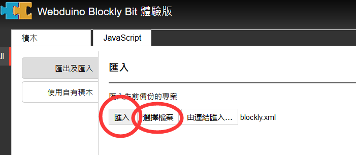
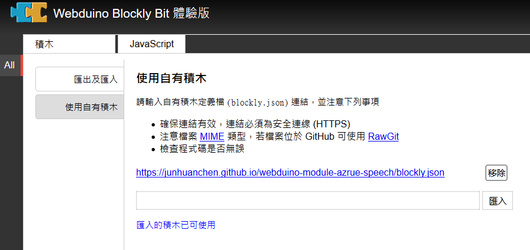
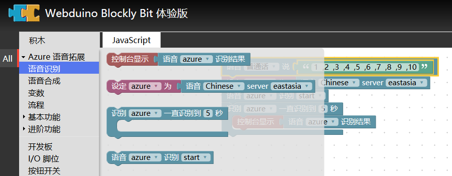

# webduino-module-azrue-speech
It provide HTML5 Automatic Speech Recognition (ASR) on Azrue Speech API 

Plug-in address: `https://junhuanchen.github.io/webduino-module-azrue-speech/blockly.json`

goto `https://bit.webduino.com.cn/blockly` website.

see this

